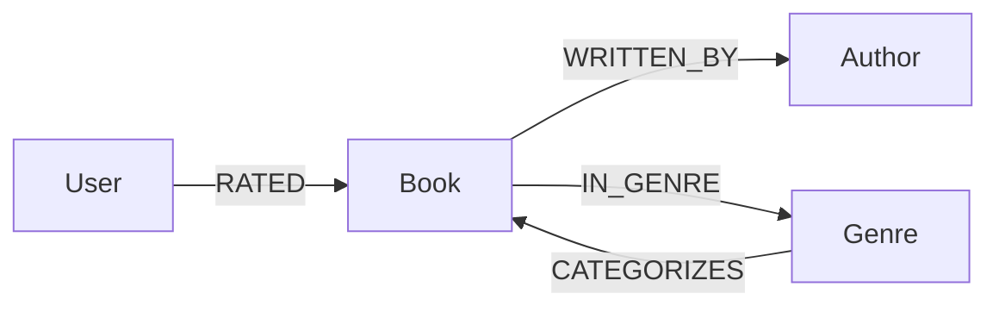

# WEXA AI CognoDB Assignment

## Project
Graph-powered Book Recommendation Explorer

This sample app demonstrates a book discovery experience with CognoDB as the graph database backend. The app lets users search books by title, author, or genre, see book details, and explore recommendations based on shared genres and user ratings.

## UI Screenshots

### Home View
The main interface features a search bar, book browsing, and detailed views with related recommendations.


### Book Details
Browse books with detailed information including author, publication year, genres, and recommendations based on shared genres.


## Demo Video

<video width="100%" controls>
  <source src="videos/Graph Book Explorer.mp4" type="video/mp4">
  Your browser does not support the video tag.
</video>

## Why a graph database?
A graph database is a strong fit for this use case because the domain is about relationships:
- Books are connected to authors and genres.
- Users rate books, creating preference edges.
- Recommendations come from multi-hop traversals through shared genres and reader behavior.

In a relational database, queries like "find books by authors who write in related genres" or "recommend books liked by users who also liked these genres" require multiple JOINs and complicated aggregation. In a graph model, those patterns map directly to traversals over labeled nodes and typed relationships.

## Data model



Nodes:
- `User`
- `Book`
- `Author`
- `Genre`

Relationships:
- `(:User)-[:RATED {rating}]->(:Book)`
- `(:Book)-[:WRITTEN_BY]->(:Author)`
- `(:Book)-[:IN_GENRE]->(:Genre)`

## Main Cypher queries

### Search books
Search by book title, author name, or genre name using a parameterized query.

`/api/books?q=<search>` uses:
```cypher
MATCH (b:Book)-[:WRITTEN_BY]->(a:Author)
OPTIONAL MATCH (b)-[:IN_GENRE]->(g:Genre)
WHERE toLower(b.title) CONTAINS toLower($query)
   OR toLower(a.name) CONTAINS toLower($query)
   OR toLower(g.name) CONTAINS toLower($query)
WITH b, a, collect(g.name) AS genres
RETURN b { .title, .summary, .published, genres, id: id(b) } AS book, a.name AS author
ORDER BY b.title ASC
LIMIT 50
```

### Book details and recommendations
Get book metadata, genre tags, user ratings, and similar books sharing genres.

`/api/books/:id` uses:
```cypher
MATCH (b:Book)-[:WRITTEN_BY]->(a:Author)
OPTIONAL MATCH (b)-[:IN_GENRE]->(g:Genre)
OPTIONAL MATCH (u:User)-[r:RATED]->(b)
WHERE id(b) = $bookId
WITH b, a, collect(g.name) AS genres, collect({ user: u.name, rating: r.rating }) AS ratings
RETURN b { .title, .summary, .published, genres, id: id(b) } AS book,
       a.name AS author,
       genres,
       ratings
```

Recommendations query:
```cypher
MATCH (b:Book)-[:IN_GENRE]->(g:Genre)<-[:IN_GENRE]-(other:Book)
WHERE id(b) = $bookId AND id(other) <> $bookId
WITH other, count(g) AS sharedGenres
ORDER BY sharedGenres DESC, other.title ASC
LIMIT 5
RETURN other { .title, .summary, .published, id: id(other) } AS book
```

### Graph-driven recommendations
The app also includes a recommendation endpoint that finds books connected through positive ratings and shared genres:

`/api/recommendations`
```cypher
MATCH (u:User)-[r:RATED]->(b:Book)-[:IN_GENRE]->(g:Genre)<-[:IN_GENRE]-(other:Book)
WHERE r.rating >= 4
  AND NOT (u)-[:RATED]->(other)
WITH other, count(DISTINCT g) AS sharedGenres, avg(r.rating) AS avgRating
ORDER BY sharedGenres DESC, avgRating DESC
LIMIT 20
RETURN other { .title, .summary, .published, id: id(other) } AS book
```

## Setup

1. Create a CognoDB instance at https://console.cognodb.com/signup.
2. Copy the `bolt+s://<instance-id>.databases.cognodb.cloud` URI and the generated password for `cognodb`.
3. Create `server/.env` with:

```env
COGNODB_URI=bolt+s://<instance-id>.databases.cognodb.cloud
COGNODB_USER=cognodb
COGNODB_PASSWORD=<password>
```

4. Install backend dependencies:

```bash
cd server
npm install
```

5. Install frontend dependencies:

```bash
cd ../client
npm install
```

6. Seed data and developer utilities

- This repository no longer includes an automated `seed.js` script or bundled sample data. To populate the database for local development you can:
  - Use the app UI (`Add Book` / `Add Film`) or call the API endpoints directly (`POST /api/books`, `POST /api/films`).
  - Create your own seed script (e.g. `server/tools/seed.js`) that reads a `server/data/seed.json` file and posts to the API.

- Destructive utility to clear the database (use with caution):

```bash
cd server
node clear-db.js
```

- Debug helpers: see `server/debug/` for small utilities (for example `queryById.js`) that help inspect nodes by internal id.

- Removed files: `server/seed.js`, `server/postBookTest.js`, `server/postFilm.js`, `server/books.json`, and `server/film.json` were intentionally deleted to keep the repo minimal.

7. Start the backend and frontend in separate terminals:

```bash
cd server
npm start
```

```bash
cd client
npm run dev
```

8. Open the frontend at `http://localhost:5173`.

## Architecture
- `server/index.js`: Express API connecting to CognoDB via the Neo4j Bolt driver.
- `server/clear-db.js`: Utility to clear the database when needed.
- `server/debug/queryById.js`: Small developer helper to inspect nodes by internal id.
- `client/src/App.jsx`: React UI for search, book list, details, and recommendations.
- `client/vite.config.js`: Local proxy from `/api` to `http://localhost:4000`.

## Notes
- All database credentials are read from environment variables.
- The app handles unreachable database errors by returning error responses and showing friendly messages in the UI.
- The graph model is designed for exploration and recommendations rather than simple row-level storage.
